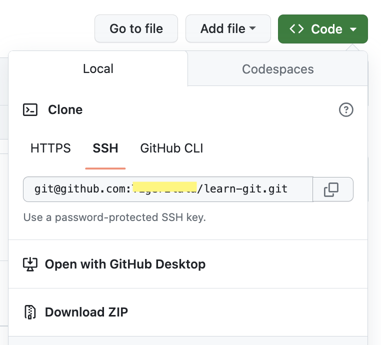
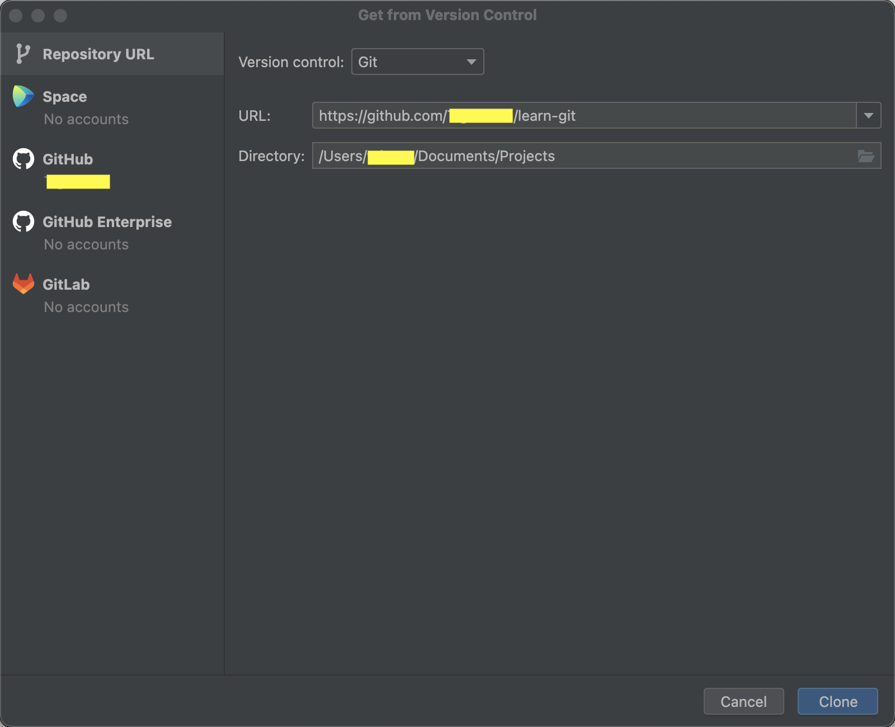
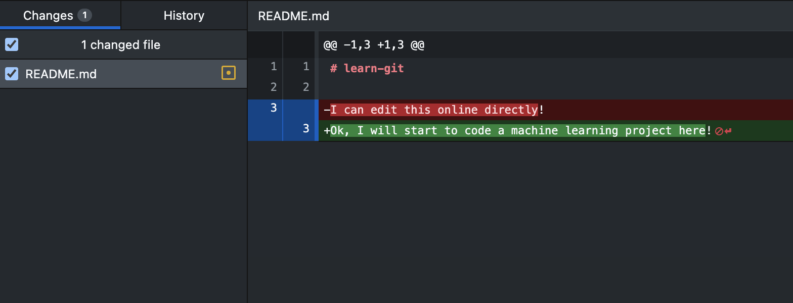
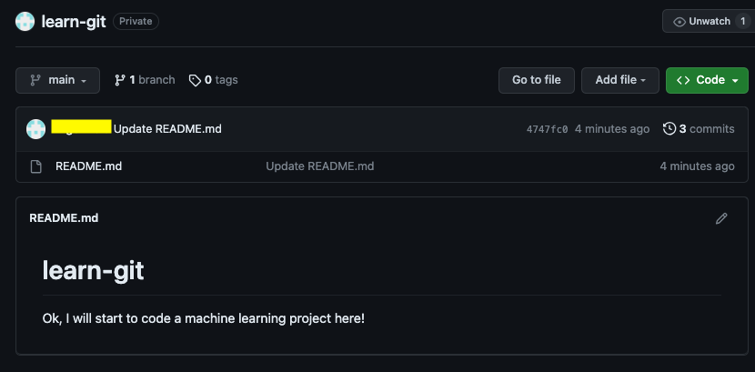
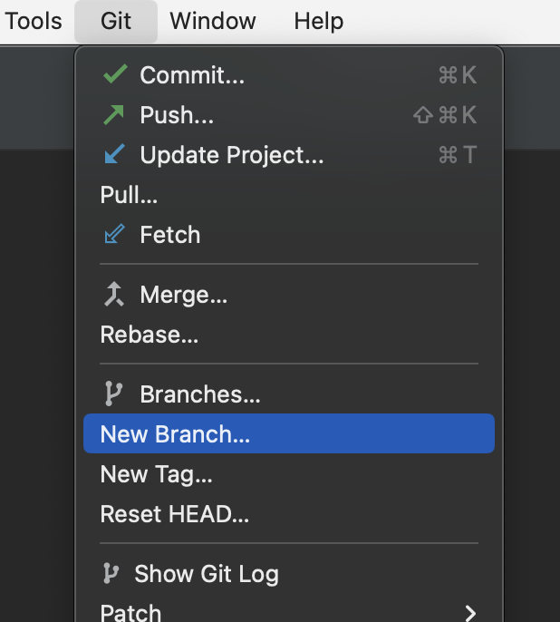
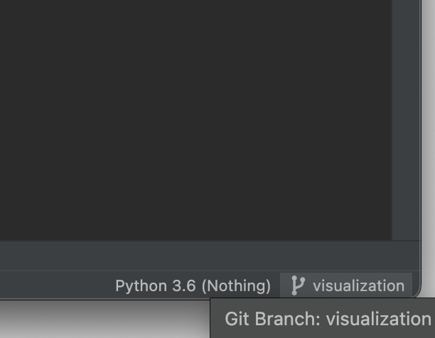

# 4 Learn the workflow from case studies

We have now installed Git on our local machine, familiarised ourselves with the interfaces, and tested out a local repository. However, to realize more advantages of version control (e.g. collaboration, improving reproducibility), we will need to take it online.

This chapter will guide you through exactly how this is done, step by step, from simpler use cases to more advanced ones.

As discussed previously, there are a wide variety of hosting services. Here, only as an example, we use the well-known GitHub platform as our remote server. 

## 4.1 Starting a new single person repository

In this example, we will make a fresh repository on GitHub, make some changes from the browser, and clone a local copy so that we can work on it offline.

!!! info Note
    Chapter 4.2 describes the variation if you already have a local repository (like we have done in the previous chapter).

### Create a repo on GitHub

First, log in to GitHub. Click the "+" and then "New repository" on the top right corner.


Then, give the new repo a meaningful name (we will call it `learn-git`), and why not add a README file. Click the big green button at the bottom. Simple as that, we made a repository on GitHub.


### Made changes from the browser

A very convenient feature of the online platforms like GitHub is that they allow us to make certain changes directly from the browser. For example, click into the `README.md` file, and then click on the pencil button on the right hand side:


Now we are in a text editor, and can make any changes we want to this file. Once finished, click the green "Commit changes" to save.

!!! info Note
    Why the "Commit changes", but not a simple "Save"? Remember, Git keeps a history for everything. By editing on from the browser, we have essentially done "saving the file", "stage the file" and "commit changes" with one step!


Here you can input a commit message to describe what changes you have made. Then click the green "Commit changes" button again, and all done.

### Clone the repo to local computer

For day to day coding and scripting, we probably still want to work locally on our computers with IDEs or more sophisticated editors. To do this in our new repository, we first need to make a local clone on our computer. This is very easy to do.

Go to the homepage of our repo on Github. Click the green "< > Code" button at the top right corner above the file list. Click on the "SSH" tab.



!!! info Note
    SSH is more secure than HTTPS. If you have set up your SSH keys successfully in the previous chapter, always try to use the SSH links.

Now there are several options:

- If you are working with GitHub Desktop, simply click on the link "Open with GitHub Desktop". You can choose where you want to keep the local copy.


- Otherwise, copy the line of link (with the button on the right). Go to your preferred IDE and clone the repo there. 



- If you work with commandlines, go to the parent folder where you want the new repo to be copied into, and then use the `git clone` command (replacing `<some-parent-folder>` and `<your-github-id>`):

```bash
cd <some-parent-folder>
git clone git@github.com:<your-github-id>/learn-git.git
```

Look inside the `learn-git` folder. You have the new repo cloned onto your computer!

### Make changes locally and keep the remote updated

As you make new changes in this folder, you can make local commits just as you did in #3.6. 

!!! example "Exercise"
    If you want to make an edit to the `README.md` file, what steps do you need to take to make the commit?

    ??? success "Solution"
        1. Edit with an editor of your choice.
        
        2. Stage `README.md` file.
        
        3. Make commit.
        

As long as you are on a single branch, the only extra step to take to update the remote is "pushing". 

In GitHub Desktop, this is done by simply clicking the `Push` button on the top banner:


Have a look on the GitHub website. It's updated with the local changes!



## 4.2 Setting up a new online repository for an existing local repository

Sometimes, we may have already written some code and created a local repository (like what we did in #3.6). Now we want to set up a remote repository and send our code to it, so that our local work is backed up online, and later be shared.

Here we use an example of `learn-git1` local repository with 2 files already commited.

### Publish with GitHub Desktop

If you use GitHub Desktop, the process is very easy. On the top banner, click the `Publish repository` button.


Then enter descriptions and click publish! All done.


### Without GitHub Desktop

The whole process is similar to Chapter 4.1, except in some small details. 

### Create a repo on GitHub

First, log in to GitHub. Click the "+" and then "New repository" on the top right corner.


Then, give the new repo a meaningful name (probably sensible to be the same as your local folder name). To make life simple, do NOT initialize or add any files.


!!! example "Exercise"
    What will happen if we initialized with, e.g. a README file?

    ??? success "Solution"
        The remote repo on Github will have the README file, while our local repo does not. On the other hand, remember that our local repo has some existing codes that the remote does not have. Therefore, as soon as we try to link the two together, there will be a conflict.

Click the big green button at the bottom to create the repo.

### Connect to the local repo

Since the new online repository is completely empty, GitHub then shows you exactly how to connect to the local repository.

With your IDE, go to the version control tab and look for `Manage remote`. 


Click `Add remote`, and paste in the URL to the GitHub repository page.


Now, do a *push*, which will update all the existing local commits to the remote.


That's all done! Have a look on the GitHub website. It's updated with the local changes!


## 4.3 Making branches and collaborating

Now the project is growing, and some colleagues want to work on the code together. Without Git, this would be a slow process, as only one of you can work on the code at a time. Otherwise, it would be difficult to combine the changes.

With Git, however, code collaboration can work very efficiently. This is achieved by branching, merging and pull requests.

### Editing on a new branch

As explained in Chapter 3 and 5, the purpose of *branches* is to separate different strands of work. 

Here for example, while your colleague will write some hypothesis tests on the data, you would like to make more plots to visualize data. So, before coding, you create and checkout a branch `visualization`.

> *Checkout* simply means making this the active branch, so that the following edits will be made on this branch.

In GitHub Desktop, click the branch box on the top banner, and click new branch.


Enter the new branch name and create.


After switching, the active branch is now `visualization` which can be seen on the top banner.

Alternatively, in PyCharm, create the new branch from the Git menu:



To verify the active branch, look for the Git symbol at the bottom of the screen. Most IDEs have a similar display.



Now you can modify the code, without the need to worry about what your colleague is doing. After some hard work in coding, you can stage, commit and push as usual. Everything is saved on the new `visualization` branch.

### Merging and pull requests

When you think you have finished all the codes related to `visualization`, you will want to *merge* this branch back to the base branch (in our case `master`), so that collaborators and users will be able to see and use these codes by default.

To do this, we first open a *pull request*. 

Go to the repository webpage on GitHub, and click on the "Pull requests" tab. GitHub likely realizes that you are opening the pull request for the most recent branch, `visualization`. Click the green "Compare & pull request" button.


